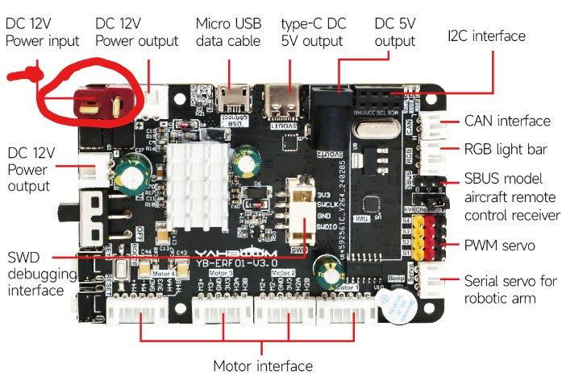
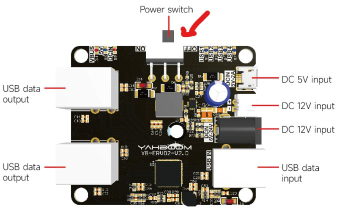
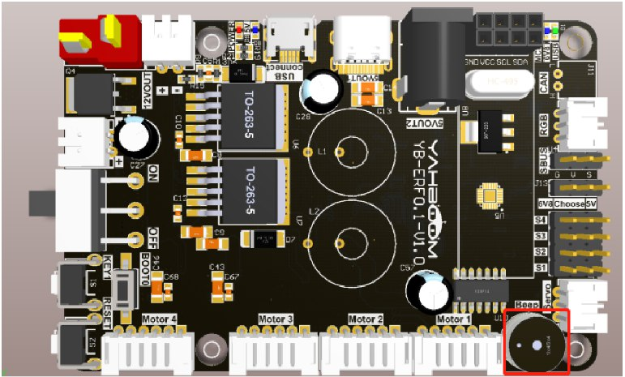
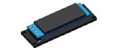
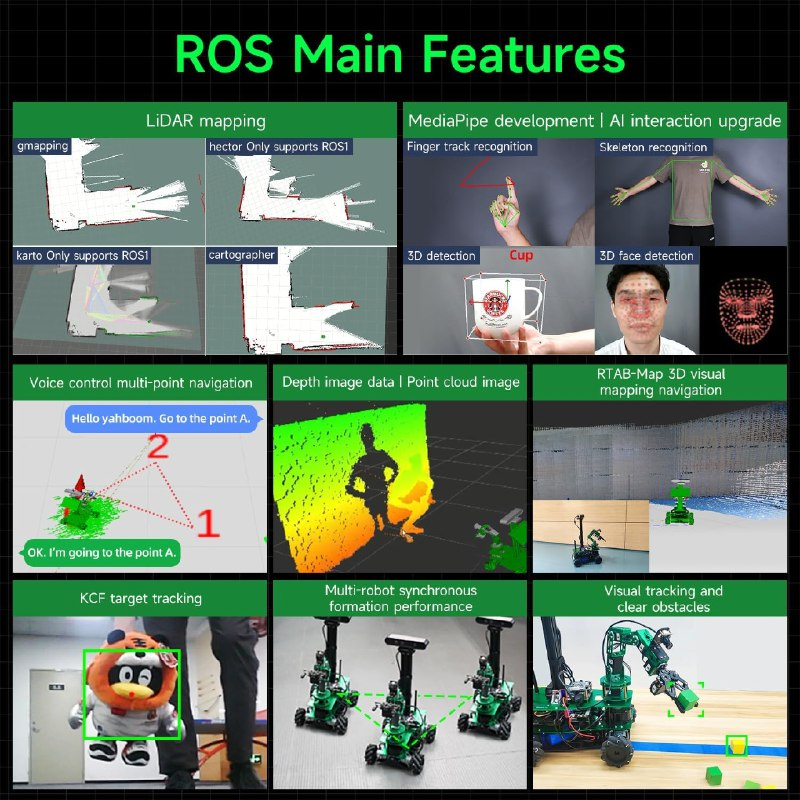

# Procedimiento de encendido, operación y apagado de X3P

## ENCENDIO
Una vez que se tenga grabada la imagen del sistema especifica del robot dentro de la micro SD o en su defecto que se use el disco U (para la versión Jetson NANO 4GB), SSD (para la versión Jetson Orin Nano/Orin NX) y tarjeta TF (para la versión Raspberry Pi) proporcionados por Yahboom que ya tienen pregrabada la imagen del sistema especifica, y que además se tengan completo todo el procedimiento de instalación y cableado del robot, todo de acuerdo a los diagramas de conexión proporcionados, los pasos a seguir son los siguientes:

- Asegurarse que la funete de poder este bien conectada nuestro robot (bateria, eliminador,...).

- Colocar en posición de encedido el switch.

- Esperar pacientemente por 2-3 minutos hasta que el buzer suene 3 veces, lo que significa que el sistemas se ha iniciado exitosamente.

- Finalmente se desplegara información en el display OLED, en la pnatalla de 7 pulgadas se vera como inicia ROSMASTER

## OPERACIÓN 

Una vez completado el proceso de encendio, el robot cuenta con diferentes modos de operación:

- Aplicación de celular:
    - El proceso se encunetra descrito en 

- Usando ROS
 - En ROS (Robot Operating System), la operación de un robot como el ROSMASTER X3 PLUS se basa en una arquitectura modular donde cada componente (sensores, motores, cámaras, etc.) es gestionado por un conjunto de nodos que se comunican entre sí a través de tópicos y servicios. A continuación, se describe el flujo general para la operación de un robot en ROS:
    - Iniciar roscore.
    - Lanzar nodos de sensores y actuadores.
    - Ejecutar el sistema de navegación y control del brazo.
    - Enviar comandos de movimiento mediante rostopic.
    - Visualizar datos en RViz.
    - Detener nodos y servicios.
    - Apagar el robot.

Algunos de sus modos de operación incluyen:

- Control remoto: Puede ser operado mediante aplicaciones móviles, controles de mando o teclados de computadora.
- Navegación y mapeo: Utiliza un lidar de alto rendimiento y una cámara de profundidad para crear mapas y navegar en entornos interiores y exteriores.
- Reconocimiento de características humanas: Es capaz de identificar y responder a características humanas específicas.
- Control del brazo robótico: Incluye un brazo robótico de 6 grados de libertad que puede realizar tareas como agarrar y manipular objetos.
- Control sincrónico de múltiples máquinas: Permite la coordinación entre varios robots para trabajar en conjunto.
- Conducción automática: Puede moverse de manera autónoma en entornos predefinidos.

## APAGADO 

- Finalización de Nodos y Procesos:
    - Detén todos los nodos y procesos de ROS que estén en ejecución.​
- Apagado de la Controladora:
    - Apaga el sistema operativo  (ROSCORE) de la controladora de manera segura.​
- Desconexión de la Fuente de Energía:
    - Apaga el interruptor principal del robot.​
    - Desconecta la batería o la fuente de alimentación externa.