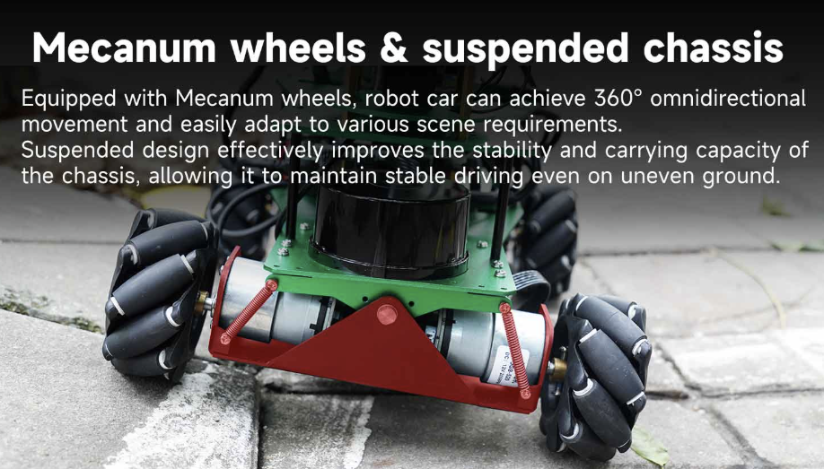

## **Restricciones de Software, Hardware y Mecánicas**  

### **1. Restricciones de Hardware**  
**Compatibilidad de controladores**:  
El ROSMASTER X3 PLUS es compatible con las siguientes plataformas:  
  - Jetson NANO 4GB  
  - Jetson Orin NX  
  - Jetson Orin NANO  
  - Raspberry Pi 5  

  El uso de otras plataformas no garantizadas por el fabricante puede resultar en problemas de compatibilidad con los sensores, motores y sistemas de comunicación del robot.  

    

- **Capacidad de carga**:  
  Aunque el ROSMASTER X3 PLUS está equipado con un brazo robótico de 6 grados de libertad (**6DOF**), la documentación proporcionada no especifica la capacidad de carga máxima recomendada. Es importante consultar directamente al fabricante o revisar manuales técnicos detallados para obtener esta información y evitar sobrecargar el brazo, lo que podría afectar su precisión y durabilidad.  

- **Limitaciones físicas**:  
  El diseño del **ROSMASTER X3 PLUS** incorpora **ruedas mecanum y suspensión de péndulo**, lo que le permite desplazarse de manera omnidireccional y adaptarse a terrenos irregulares. Sin embargo, la información disponible no detalla las **pendientes máximas** que puede superar, los **tipos de obstáculos** que puede sortear o los **terrenos más adecuados** para su operación óptima.  

  Para garantizar un rendimiento seguro y eficiente, se recomienda operar el robot en **superficies planas y lisas** hasta obtener datos más específicos del fabricante.  

---

### **2. Restricciones de Software**  
El **ROSMASTER X3 PLUS** opera sobre el sistema **ROS (Robot Operating System)** y cuenta con diversas restricciones de software que deben considerarse para garantizar su funcionamiento óptimo y evitar conflictos en la integración con otros sistemas.  

- **Compatibilidad con ROS**:  
  El robot está diseñado para funcionar con **ROS 1 y ROS 2**, sin embargo, ciertas funcionalidades pueden requerir **versiones específicas** del sistema. El uso de versiones no recomendadas podría generar **incompatibilidades** con los paquetes de navegación, percepción y control del robot.  

- **Lenguajes de programación soportados**:  
  La programación del **ROSMASTER X3 PLUS** se basa principalmente en **Python** y **C++**, ya que estos son los lenguajes más utilizados en ROS. Aunque otros lenguajes pueden ser empleados, la compatibilidad con los controladores y paquetes disponibles podría verse limitada.  

- **Dependencias y librerías**:  
  El sistema requiere el uso de diversas **librerías propietarias y de terceros** para la gestión del brazo robótico, navegación y procesamiento de datos. Algunas de las principales dependencias incluyen:  

  - `MoveIt!` → Planificación de trayectorias del brazo robótico.  
  - `Gazebo` → Simulación del entorno robótico.  
  - `OpenCV` y `PCL` → Visión computacional y procesamiento de nubes de puntos.  
  - `rplidar_ros` → Uso del LiDAR en mapeo y navegación.  
  - `ros_control` y `rosserial` → Comunicación con motores y sensores.  

  Estas restricciones deben ser tomadas en cuenta al desarrollar aplicaciones para el **ROSMASTER X3 PLUS**, asegurando que el entorno de trabajo sea **compatible con las herramientas y controladores disponibles**.  

---

### **3. Restricciones Mecánicas**  
El **ROSMASTER X3 PLUS** cuenta con un diseño robusto y versátil, pero presenta ciertas limitaciones mecánicas que deben considerarse para su operación segura y eficiente.  

- **Superficies de operación**:  
  El chasis del robot está equipado con **ruedas mecanum y suspensión de péndulo**, lo que le permite desplazarse de manera omnidireccional y adaptarse a **terrenos irregulares**. Sin embargo, su desempeño óptimo se obtiene en **superficies planas y firmes**.  

    

  El uso en terrenos demasiado accidentados, con **desniveles bruscos o materiales sueltos** (arena, grava, barro) puede afectar la estabilidad y precisión del desplazamiento.  

- **Factores ambientales**:  
  Aunque el robot está diseñado para uso en **interiores y exteriores**, **no cuenta con protección** contra agua o polvo en exceso. Su exposición a condiciones climáticas adversas como **lluvia, humedad extrema o temperaturas extremas** puede comprometer el funcionamiento de sus **componentes electrónicos y mecánicos**.  

- **Mantenimiento necesario**:  
  Para asegurar un rendimiento adecuado, es necesario realizar un **mantenimiento periódico** en las siguientes áreas:  

  - **Limpieza del LiDAR y sensores** → Evitar errores en la percepción del entorno.  
  - **Revisión de los motores y conexiones** → Prevenir fallos en la movilidad.  
  - **Verificación de la alineación del brazo robótico** → Garantizar precisión en la manipulación de objetos.  
  - **Carga y calibración de la batería** → Evitar interrupciones inesperadas en la operación.  

---

