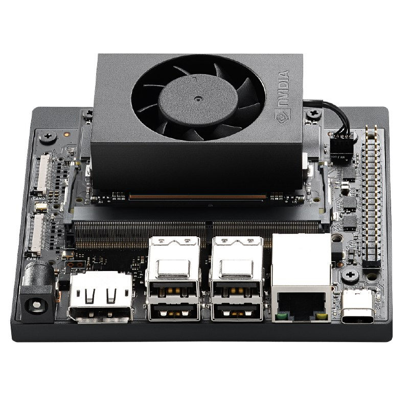
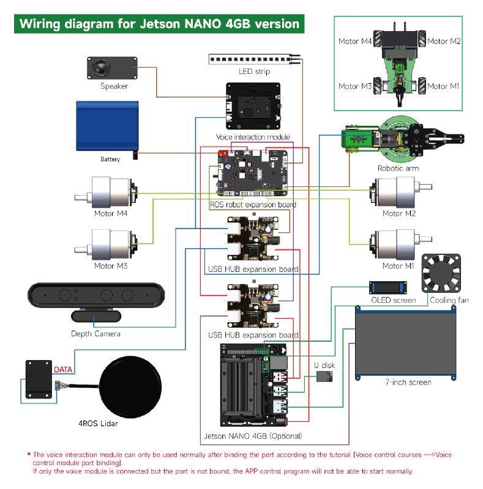

# Sistema electrónico del X3P

# **Descripción completa del sistema electrónico**  

El sistema electrónico del **ROSMASTER X3 Plus** está diseñado para ofrecer una plataforma de operación autónoma y teleoperada, integrando hardware avanzado para control de movimiento, percepción y procesamiento en tiempo real. La base del sistema es la **Jetson Nano de 4 GB**, que se encarga de la computación de alto rendimiento y la gestión de datos de sensores y actuadores mediante el sistema operativo **ROS** (Robot Operating System).

## **1. Unidad de procesamiento central (Jetson Nano 4 GB)**
- **Modelo:** Jetson Nano 4 GB (opcional)  
- **CPU:** ARM Cortex-A57 de cuatro núcleos  
- **GPU:** NVIDIA Maxwell de 128 núcleos  
- **Memoria:** 4 GB LPDDR4  
- **Almacenamiento:** Tarjeta microSD (mínimo 16 GB)  
- **Sistema Operativo:** Ubuntu 18.04 o superior con ROS Melodic o ROS Noetic  

### **Interfaces de conexión:**
- 4 puertos USB 3.0 para periféricos (sensores, cámaras, expansión)  
- Puerto HDMI para la pantalla táctil de 7"  
- GPIO para señales digitales de control  
- Conexión UART y I2C para comunicación con módulos externos  
- Puerto Ethernet para conectividad de red  

## **2. Módulo de expansión de robot para ROS**
Este módulo es una interfaz directa entre la Jetson Nano y los actuadores y sensores del robot.  

### **Funciones:**
- Control de motores DC mediante señales PWM  
- Interfaz UART para el módulo de interacción por voz  
- Recepción de datos de sensores mediante I2C y UART  
- Control de la tira de LEDs mediante PWM o señales digitales  

### **Conexiones:**  
- **Motores:** 4 motores de tracción (M1, M2, M3, M4)  
- **Brazo robótico:** Hasta 6 servomotores (5 DOF + gripper)  
- **LIDAR:** Interfaz UART o I2C  
- **Pantalla OLED:** Interfaz I2C  
- **Cámara de profundidad:** Conexión USB directa a la Jetson Nano  
- **Ventilador:** Alimentación directa desde la placa de expansión  

## **3. Actuadores**  
El robot cuenta con dos tipos de actuadores principales:

###  **Motores de tracción**  
- **Cantidad:** 4 motores DC  
- **Tipo:** Motores 520 con encoder para retroalimentación  
- **Configuración:** Disposición mecanum (movimiento omnidireccional)  
- **Control:** PWM desde la placa de expansión ROS  

###  **Brazo robótico**  
- **Cantidad de grados de libertad:** 5 DOF + gripper  
- **Modelo de servos:**  
   - 5 x 15 kg/cm Power HD 1501MG para las articulaciones  
   - 1 x 13 kg/cm Hitec HS-422 para el gripper  
- **Control:** PWM desde la placa de expansión ROS  

## **4. Sensores**  
El robot está equipado con sensores para navegación, percepción y control de entorno:

###  **LIDAR (4ROS Lidar)**  
- **Interfaz:** UART  
- **Función:** Mapeo y navegación mediante ROS  
- **Datos:** Distancia y obstáculos  

###  **Cámara de profundidad**  
- **Interfaz:** USB  
- **Función:** Generación de nube de puntos para SLAM y reconocimiento de objetos  

###  **Sensores adicionales:**  
- **Sensor de temperatura:** Monitoreo de la Jetson Nano  
- **Sensor de corriente:** Control de consumo de los motores  

## **5. Módulos de interfaz y control**  
El sistema cuenta con varios módulos de interfaz para facilitar el control y la interacción:

###  **Módulo de interacción por voz**  
- **Interfaz:** UART  
- **Función:** Reconocimiento de comandos de voz mediante ROS  
- **Control:** Directo desde la placa de expansión  

###  **Tira de LEDs**  
- **Interfaz:** PWM o señal digital  
- **Función:** Retroalimentación visual y estado operativo del robot  

###  **Pantalla OLED**  
- **Interfaz:** I2C  
- **Función:** Mostrar información en tiempo real sobre el estado del robot  

###  **Ventilador**  
- **Interfaz:** GPIO  
- **Función:** Refrigeración activa de la Jetson Nano  

###  **Pantalla de 7 pulgadas**  
- **Interfaz:** HDMI  
- **Función:**  
   - Interfaz gráfica para el control del robot  
   - Visualización en tiempo real de datos de sensores  
   - Permite ejecutar herramientas gráficas de ROS como **RViz** y **rqt**  
   - Interacción directa con el entorno operativo de ROS  

## **6. Sistema de alimentación**  
El robot está equipado con una batería de alto rendimiento para garantizar un funcionamiento autónomo:

- **Tipo de batería:** Li-ion de alta capacidad  
- **Conexión:** Directa a la placa de expansión para la distribución de energía  
- **Protección:** Sistema de protección contra sobrecorriente y sobrecarga  

## **7. Conexiones USB y expansión**  
El robot cuenta con múltiples puertos de expansión para la integración de nuevos módulos:

- **Placa de expansión USB HUB** para aumentar el número de puertos disponibles  
- **Puertos GPIO** para añadir sensores adicionales o módulos personalizados  
- **Puerto Ethernet** para conectividad y teleoperación  

