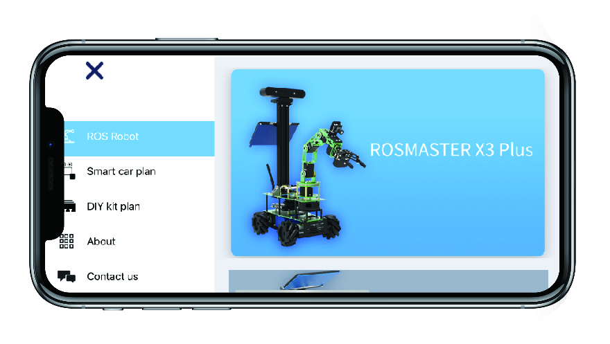
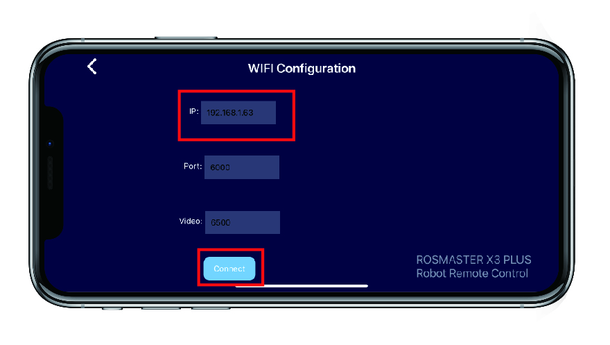
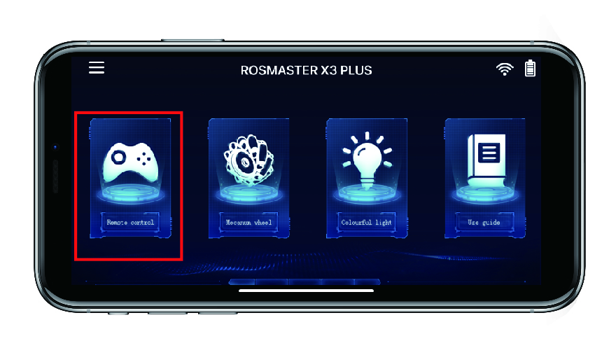
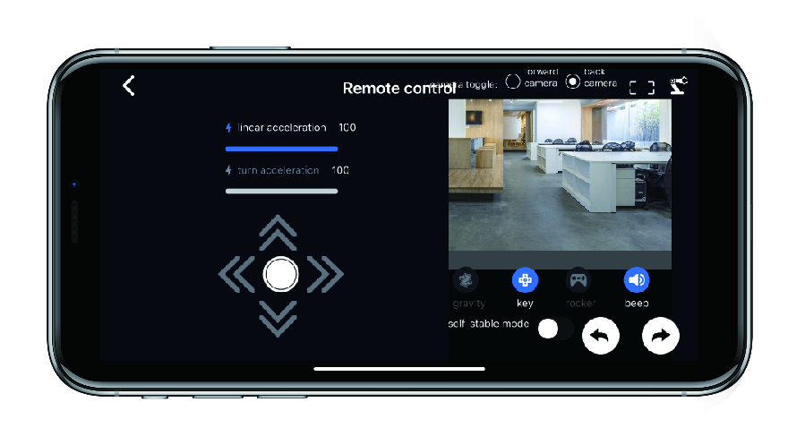
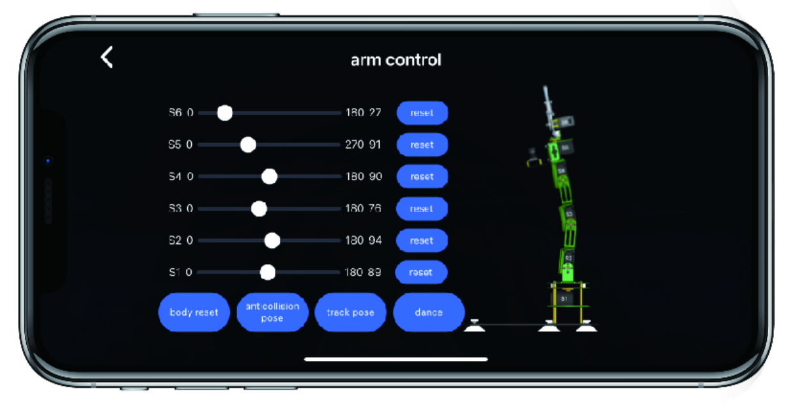
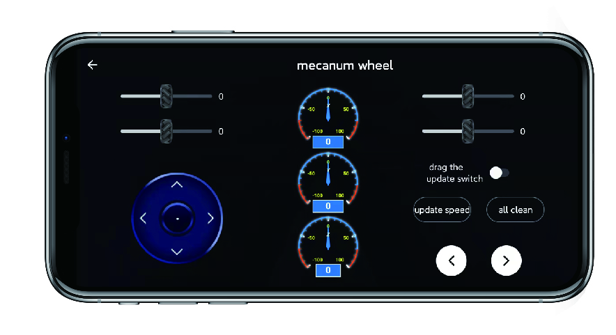
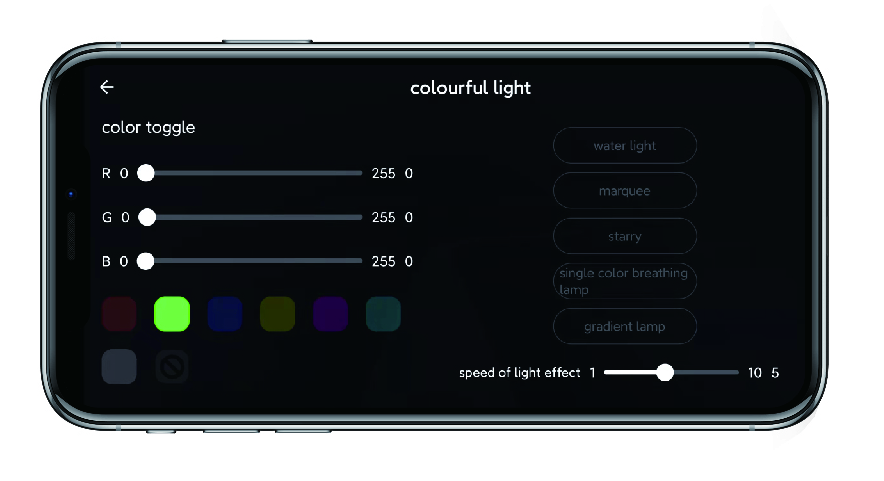
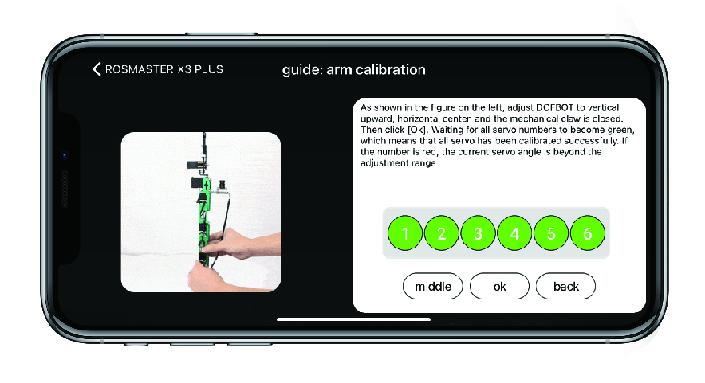

# Descripción de software, estructura de paquetes, descripción de librerías propietarias y de terceros necesarias, listado de  programas de operación del robot y descripción de su propósito.

## Software

Para el uso de este robot, YAHBOOM proporciona una diversa cantidad de archivos, entre los cuales se encuentran archivos de firmware, librerias y paquetes de ros utiles para este robot, dichos archivos se pueden descargar [aqui](https://drive.google.com/drive/folders/1AsJbuwh2-tXw-CKYXkfO5Y2W7DFcXO5a):

- Expansion board STM32 firmware
- Rosmaster
- KNN
- pi5_ROS
- pi5_Software
- Pytorch
- ROS
- software
- Tensorflow
- yahboomcar_description
- yahboomcar_gazebo
- yolov4-tiny-tf2

Ademas, la documentacion contiene diversos enlaces para poder trabajar con los diversos sistemas que contiene el robot de manera individual, dichos enlaces se pueden encontrar [aqui](http://www.yahboom.net/study/ROSMASTER-X3-PLUS), como son:

- OpenCV
- Astra camera
- RPLIDAR A1 LIDAR
- Deep learning
- Voice control
- MOVE IT

### Paquetes de ros incorporados

Dentro de los archivos dados por YAHBOOM, nos encontramos con 
 paquetes especificos de ros (yahboomcar_description y yahboomcar_gazebo):

#### yahboomcar_description

#### yahboomcar_gazebo


## Encendido del robot

Para la version que se tiene en el laboratorio (Jetson NANO 4GB), se debe insertar el disco U en la Jetson nano, la cual contendra la imagen diseñada por YAHBOOM para este robot especifico, despues, se debera usar el switch de encendido del robot, y una vez inicie, en la pantalla led se mostrara informacion para ingresar al sistema, las contraseñas designadas para este robot son las siguientes:

**Raspberry Pi system, username: pi   password: yahboom**

## Control del robot

El robot ROSMASTER X3 PLUS puede ser controlado mediante la aplicacion para android e iOS [MakerControl], para esto, el usuario debe seleccionar el dispositivo [ROSMASTER X3 PLUS] en la pestaña [ROS robot].



Tras esto, el sistema requerira ingresar la direccion IP del robot y presionar "Connect" para conectarse con el robot.



Una vez dentro, el sistema le permitirá al usuario observar y manipular al robot de diversas maneras: 



- controlar de manera remota el robot con controles de movimiento


- control angular para cada uno de los elementos del brazo


- control de velocidad para cada rueda


- control de las luces del robot


- calibracion de los elementos del robot.


Tambien es posible usar este robot mediante el uso de un control inalambrico haciendo uso del docker proporcionado por YAHBOOM y corriendo los archivos siguientes en 2 terminales distintas.

``` bash
roslaunch yahboomcar_bringup bringup.launch #launch chassis + remote control 
```
``` bash
python3 rosmaster_no_control.py 
```
